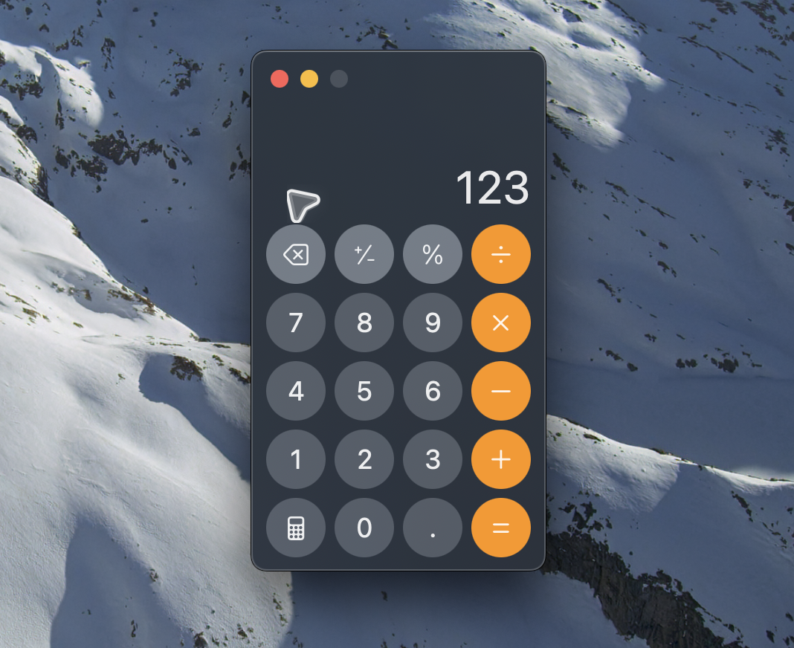

# mac-computer-use

A macOS MCP clone of Codex `@Computer Use`, built to make the same tool interfaces and desktop-control capabilities available to other coding agents.

This project reproduces the Codex Computer Use tool surface with a Node MCP server and a native Swift helper so any MCP client that supports local `stdio` servers can use a similar interface on macOS.


## Requirements

- macOS
- Node.js 20+ recommended
- Xcode Command Line Tools with `swift`
- a host app with:
  - `Accessibility` permission
  - `Screen Recording` permission

For most source installs, the host app is whichever app launches the MCP server, for example:

- Terminal
- iTerm
- Warp
- Codex
- Cursor

## Install

From the repo root:

```bash
npm install
npm run check
npm test
chmod +x bin/mac-computer-use.js
```

## Permissions Setup

Grant permissions to the app that will launch the MCP server.

Examples:

- if you run it from Terminal, enable `Terminal`
- if you run it from Codex, enable `Codex`
- if you run it from Cursor, enable `Cursor`

macOS settings to enable:

1. `System Settings > Privacy & Security > Accessibility`
2. `System Settings > Privacy & Security > Screen Recording` or `Screen & System Audio Recording`

After changing permissions, fully restart the host app.

## Run

Recommended path:

```bash
npm run start
```

Alternative CLI backend:

```bash
npm run start:cli
```

The native-helper backend is the default path. The CLI backend exists mainly for comparison and fallback.

Smoke test:

```bash
npm run smoke
```

Optional app override:

```bash
npm run smoke -- TextEdit
```

## MCP Client Config

Use the packaged launcher:

```json
{
  "mcpServers": {
    "computer-use": {
      "command": "/absolute/path/to/mac-computer-use/bin/mac-computer-use.js"
    }
  }
}
```

If your client prefers explicit runtime invocation:

```json
{
  "mcpServers": {
    "computer-use": {
      "command": "node",
      "args": ["/absolute/path/to/mac-computer-use/bin/mac-computer-use.js"]
    }
  }
}
```

## What It Does

The server exposes the same high-level tool set we observed from Codex Computer Use:

- `list_apps`
- `get_app_state`
- `click`
- `drag`
- `type_text`
- `press_key`
- `set_value`
- `scroll`
- `perform_secondary_action`

Under the hood:

- the MCP server is a Node `stdio` process
- the native behavior lives in [`helper/ComputerUseNativeHelper.swift`](./helper/ComputerUseNativeHelper.swift)
- the helper handles accessibility inspection/actions, pointer/keyboard events, screenshots, and the visible second cursor overlay

## Tool Summary

### `list_apps`

Returns a user-facing inventory of running apps plus recent non-running apps when metadata is available.

Structured result includes:

- `name`
- `bundleId`
- `pid`
- `running`
- `frontmost`
- `visible`
- `lastUsed`
- `uses`

### `get_app_state`

Returns:

- app identity
- window title
- accessibility tree text
- structured elements
- screenshot artifact when available

Structured elements include fields such as:

- `index`
- `id`
- `role`
- `title`
- `description`
- `value`
- `focused`
- `settable`
- `actions`
- `bounds`

### `click`

Currently implemented with coordinate clicks on the native backend.

### `drag`

Native pointer drag between coordinates.

### `type_text`

Literal text input using native event synthesis.

### `press_key`

Native key press support for:

- printable keys
- common special keys
- modifier combinations such as `cmd+c`, `shift+tab`

### `set_value`

Direct AX value mutation for settable UI elements.

This is one of the strongest background-safe paths.

### `scroll`

Native scroll at the target app/window center.

### `perform_secondary_action`

Executes AX actions such as:

- `Press`
- `Raise`
- `ShowMenu`

Accepts either:

- traversal index like `9`
- semantic element ID like `AllClear`

## Current Behavior

What already works:

- app listing
- app/window state snapshots with accessibility tree text
- screenshot artifacts in MCP responses
- Stage Manager thumbnail materialization for screenshots without moving the hardware cursor
- semantic element IDs like `main`, `AllClear`, `Delete`
- background-first AX actions where macOS allows it
- pointer actions with focus restore

Stage Manager note:

- when a target app is represented only as a Stage Manager side thumbnail, the native helper attempts to add it to the current stage through `WindowManager` Accessibility actions before capturing
- this avoids using the user's real cursor and then restores the previous frontmost app
- the mechanism relies on nonstandard macOS AX actions such as `AXAddToStage`, so behavior may vary across macOS versions
- a visible animated second cursor overlay

Current limitations:

- unsigned packaging, so this is not a mainstream one-click install yet
- exact bundled text/localization parity is incomplete
- background semantics are strongest for AX-backed actions; pointer/keyboard actions are still best-effort restore, not guaranteed true background control

## Example Result Shape

See:

- [`RESULT_SCHEMA.md`](./RESULT_SCHEMA.md)
- [`SPECS.md`](./SPECS.md)
- [`COMPARE.md`](./COMPARE.md)
- [`NOTES.md`](./NOTES.md)

## Development

Useful commands:

```bash
npm run check
npm test
npm run smoke
npm run start:native
```

Main files:

- [`src/server.ts`](./src/server.ts)
- [`src/native-helper-backend.ts`](./src/native-helper-backend.ts)
- [`helper/ComputerUseNativeHelper.swift`](./helper/ComputerUseNativeHelper.swift)

## Troubleshooting

### The cursor appears but does not disappear

- restart the MCP host app after pulling new changes
- re-run a real pointer action like `click` or `scroll`
- verify you are using the default native-helper backend:

```bash
npm run start
```

### Actions fail with accessibility errors

Make sure the app launching the MCP server is enabled in:

1. `System Settings > Privacy & Security > Accessibility`
2. fully quit and reopen that host app

Common examples:

- Terminal
- Codex
- Cursor
- Warp

### Screenshots are missing

Make sure the host app is enabled in:

- `System Settings > Privacy & Security > Screen Recording`

Then restart the host app.

### `npm run smoke` fails on `get_app_state`

Try again with an app that is currently open and visible:

```bash
npm run smoke -- com.apple.calculator
```

or:

```bash
npm run smoke -- TextEdit
```

### Pointer actions work but do not feel fully background-safe

That is expected.

- AX-backed actions like `set_value` and some `perform_secondary_action` cases can stay background-first
- pointer and keyboard actions are still best-effort restore, not guaranteed true background control across all apps

## Roadmap

Likely next steps:

- make it faster to use the computer
- add background control capabilities closer to Codex `@Computer Use`
- improve visualization
- signed helper app packaging
- notarization
- cleaner permission onboarding
- tighter `list_apps` ordering and naming parity
- tighter parity for text formatting and localization
